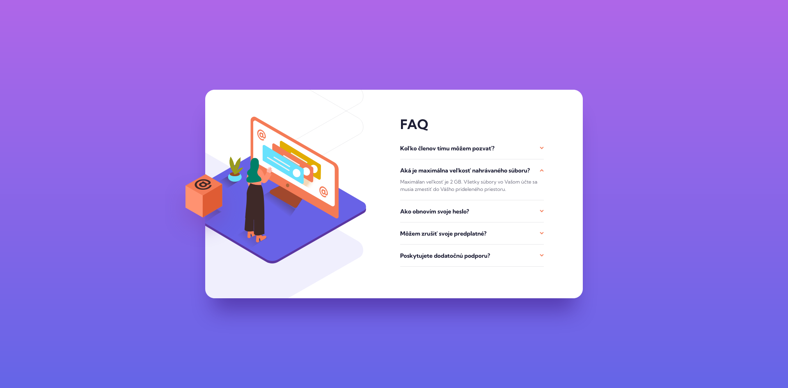
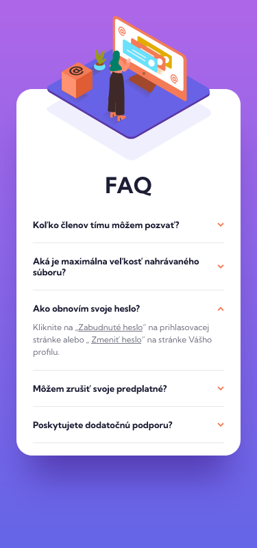

# Frontend Mentor - FAQ accordion card

## 📝 Informácie o projekte

Tento projekt je zo stránky [Frontend Mentor](https://www.frontendmentor.io/challenges/faq-accordion-card-XlyjD0Oam). Stránka Frontend Mentor ponúka projekty na vypracovanie, ktoré obsahujú základný text v HTML a grafický dizajn projektu vo Figme.

Používatelia tejto stránky môžu:

- prezerať si ju na desktope alebo na mobilnom zariadení
- vidieť interaktívne prvky pri prechádzaní stránkou
- po kliknutí na otázku zobraziť alebo skryť odpoveď

Po kliknutí na odkazy v časti "Ako obnovím svoje heslo?" sa zobrazí môj predchádzajúci projekt zo stránky [Frontend Mentor](https://github.com/tomasdunik/frontend-mentor__interactive-rating-component.git).

#### [Odkaz na hotovú stránku](https://tomasdunik.github.io/frontend-mentor__faq-accordion-card/)

 

## 🏗️ Vytvorenie projektu

Projekt som vytvoril za približne 6 hodín (čas od stiahnutia projektu až po jeho finálne publikovanie na stránke Frontend Mentor). Použil som HTML,CSS, SCSS a JavaScript. Najviac času som strávil nastavovaním obrázkov na stránke. Projekt má dizajn pre pre desktop a mobil. Anglické texty z projektu som prepísal na slovenské.

 

## 🛠️ Vytvorené s

- HTML
- CSS
- SCSS
- JavaScript

 

## 🧭 Užitočné odkazy

- [How to Code a Responsive FAQ accordion dropdown | VanillaJS Tutorial - frontend mentor challenge](https://youtu.be/WB4qM9Umzss)

 

## 📸 Screenshots

### 💻 Desktop

### 📱 Mobil

 

## 🔗 Projekty Frontend Mentor

- [Tento konkrétny projekt na stránke Frontend Mentor](https://www.frontendmentor.io/solutions/my-version-faq-accordion-card-QNenETWssh)
- [Moje ostatné projekty na stránke Frontend Mentor](https://www.frontendmentor.io/profile/WeekendsProgrammer)
